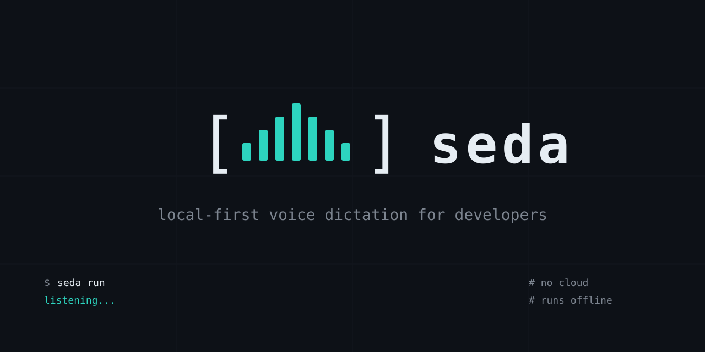
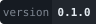
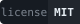
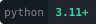

<p align="center">
  
</p>

<p align="center">
  
  
  
</p>

# Seda

Local-first, system-wide voice dictation — optimized for dictating prompts into
Claude Code and other terminal applications. Hold a global push-to-talk hotkey,
speak, release, and get **editable** text at your cursor.

> **Status:** v0.1.0 — all 8 phases complete, verified end-to-end on macOS.
> Implemented: the
> project skeleton, local `faster-whisper` transcription, microphone capture,
> global push-to-talk hotkeys, deterministic text processing (spoken commands,
> technical-token protection), clipboard paste at the cursor, optional local LLM
> cleanup (Ollama), and full diagnostics and packaging.
> See [`CHANGELOG.md`](CHANGELOG.md) for the complete history.

## Safety and privacy

Seda is built to be safe around terminals and coding agents:

- **It never presses Enter.** Automatic submission is not implemented; pasted
  text always stays editable before you submit it.
- **It runs locally.** No cloud transcription, no cloud cleanup, no telemetry,
  analytics, or update checks. After models are installed it works offline.
- **Conservative defaults.** LLM cleanup is disabled, transcript logging is
  disabled, and debug-audio retention is disabled out of the box.

## Requirements

- Python **3.11+**
- [`uv`](https://docs.astral.sh/uv/) (recommended) or `pip`

## Install (development)

```bash
uv sync --extra dev
uv run seda doctor
uv run seda config init
```

With `pip`:

```bash
python -m venv .venv && source .venv/bin/activate
pip install -e ".[dev]"
seda doctor
```

The speech backend and optional cleanup are separate extras:

```bash
uv sync --extra whisper --extra dev
uv run seda models download small.en
```

## CLI

Non-hardware commands:

```bash
seda version              # print the version
seda config path          # show the default config file path
seda config init          # write a default config file
seda config validate      # validate a config file (readable errors)
seda config show-effective  # print the effective, privacy-safe config
seda doctor               # environment + config diagnostics
seda doctor --json        # machine-readable diagnostics
```

File transcription — needs the `whisper` extra and a local model:

```bash
seda models recommend         # list recommended models
seda models download small.en # fetch a model into the local cache
seda models list-local        # list known model identifiers
seda transcribe recording.wav --stdout   # transcribe a PCM WAV file
seda transcribe recording.wav --copy      # copy the transcript to the clipboard
seda transcribe recording.wav --offline   # require a local model; never download
```

Push-to-talk dictation — hold the hotkey, speak, release, and the
transcript is pasted at your cursor:

```bash
seda run                  # start the push-to-talk loop
seda run --no-paste       # copy the transcript instead of pasting it
seda run --no-cleanup     # disable optional LLM cleanup for this run
seda devices              # list microphone input devices
seda test-mic             # record a short sample and report levels
```

Seda never presses Enter: pasted text always stays editable. If a paste
fails, the transcript is left on the clipboard and you are notified.

### Exit codes

| Code | Meaning |
| ---- | ------- |
| 0 | success |
| 1 | general runtime failure |
| 2 | invalid configuration or CLI usage |
| 3 | microphone/audio failure |
| 4 | model unavailable |
| 5 | transcription failure |
| 6 | clipboard/paste failure |
| 7 | permission failure |
| 8 | cleanup provider failure (strict mode) |

## Configuration

Configuration is TOML. See [`config.example.toml`](config.example.toml) for a
fully-commented starting point. Default location:

- macOS: `~/Library/Application Support/seda/config.toml`
- Linux: `~/.config/seda/config.toml`
- Windows: `%APPDATA%\seda\config.toml`

Override with `seda run --config /path/to/config.toml`.

## Documentation

| Document | Contents |
|---|---|
| [`docs/ARCHITECTURE.md`](docs/ARCHITECTURE.md) | State machine, data flow, thread model, backend interfaces, privacy boundaries |
| [`docs/PRIVACY.md`](docs/PRIVACY.md) | What stays local, when network access occurs, clipboard limitations |
| [`docs/TROUBLESHOOTING.md`](docs/TROUBLESHOOTING.md) | Microphone, model, hotkey, paste, Wayland, Ollama issues |
| [`docs/CLAUDE_CODE_USAGE.md`](docs/CLAUDE_CODE_USAGE.md) | Prompt styles, spoken commands, modes, multiline policy |
| [`CHANGELOG.md`](CHANGELOG.md) | Version history and known limitations |

## Development

```bash
uv run ruff format --check .
uv run ruff check .
uv run mypy src
uv run pytest -m "not integration"
```

## License

[MIT](LICENSE)
